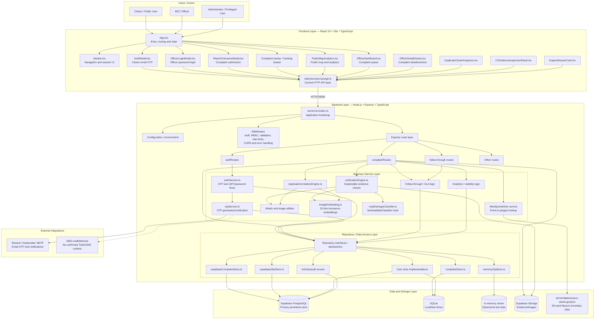
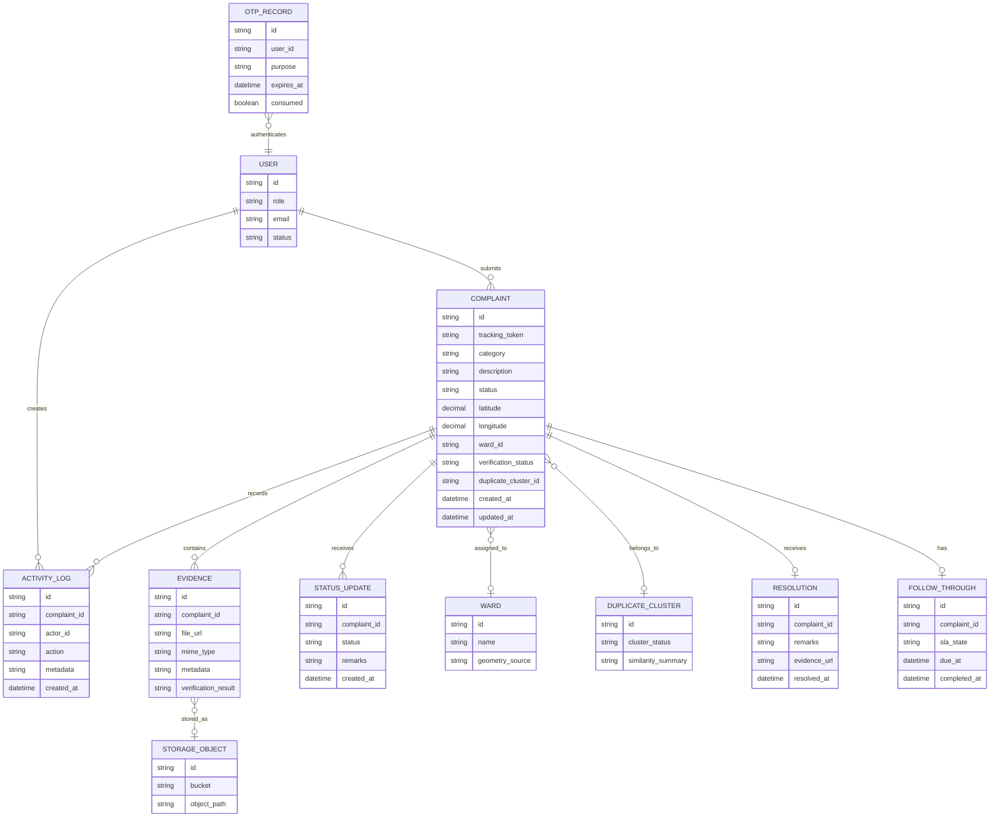
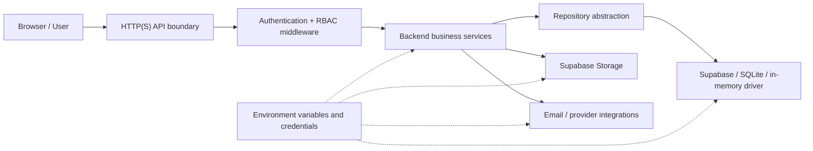
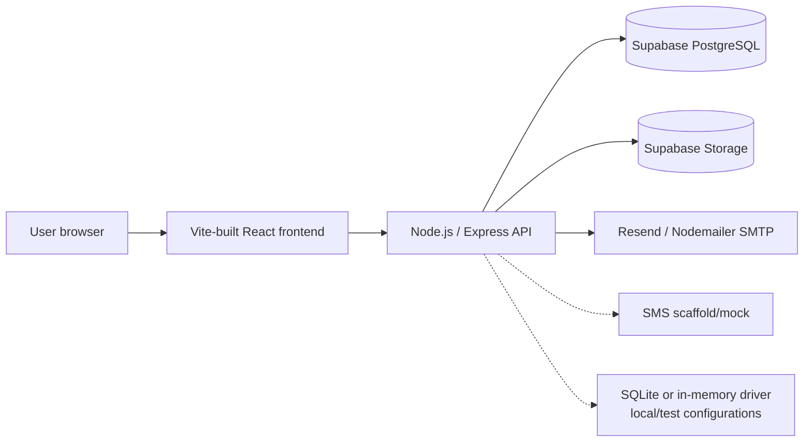
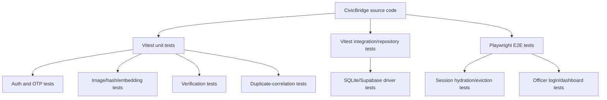

 # Architecture

[← Back to README](../README.md)

## System Diagram

## Request Walkthrough

### Citizen submits a complaint

1. The citizen opens the React application in a browser.
2. `App.tsx` renders the citizen experience and session-aware navigation.
3. The citizen opens `ReportGrievanceModal.tsx`.
4. The client collects description/category information, GPS/location data where available, and evidence such as an image.
5. The frontend sends the request through `client/src/services/api.ts`.
6. Express receives the request through the complaint route layer.
7. Middleware applies the relevant authentication, RBAC, validation, rate-limit, CORS and error-handling checks.
8. The complaint repository creates or updates the complaint using the configured storage driver.
9. `verificationEngine.ts` evaluates available evidence using EXIF/metadata, geographic consistency, dHash, image-derived features and rule-based signals.
10. `duplicateCorrelationEngine.ts` searches for potentially related or duplicate complaints.
11. The ward service loads `server/data/mysuru-wards.geojson` and performs point-in-polygon lookup against the available 65-ward data.
12. Ward/jurisdiction information is attached when valid location data is available.
13. The complaint becomes available to the applicable officer workflow.
14. The citizen can track status through the tracker interface.
15. Officers inspect evidence, verification results, duplicate relationships and complaint details.
16. Resolution may include remarks and resolution evidence.
17. Follow-through and activity/audit records support lifecycle history.
18. Public map/analytics views expose the backend-approved public information.

### Citizen email OTP login

1. `AuthModal.tsx` requests an email OTP through `api.ts`.
2. `authService.ts` and `otpService.ts` generate and validate the OTP.
3. The configured OTP store is selected: Supabase-backed persistence or an in-memory test store.
4. Resend/Nodemailer SMTP sends the email when configured.
5. The submitted OTP is verified and the authenticated session/token response is returned.
6. The frontend hydrates the session and renders the authenticated experience.

### MCC officer login

1. `OfficerLoginModal.tsx` submits officer credentials.
2. The authentication service validates the credentials.
3. The backend issues the officer JWT/session response.
4. Role-aware middleware protects officer-only operations.
5. The officer dashboard displays the permitted queue and inspection actions.

## Components

| Component | Responsibility | Tech | Code location / evidence |
|---|---|---|---|
| Application entry | UI state, session-aware rendering and dashboard control | React 19, TypeScript | `client/src/App.tsx` |
| Navigation | Role-aware navigation and session-aware UI | React, TypeScript | `client/src/components/Navbar.tsx` |
| Citizen auth | Email OTP request, entry and verification | React, TypeScript | `client/src/components/auth/AuthModal.tsx` |
| Officer auth | Password login and officer session initiation | React, TypeScript | `client/src/components/auth/OfficerLoginModal.tsx` |
| Complaint submission | Complaint form, location capture and evidence submission | React, TypeScript | `client/src/components/ReportGrievanceModal.tsx` |
| Complaint tracking | Citizen status lookup and display | React, TypeScript | Tracker/tracking drawer components |
| Public map/analytics | Public geographic visibility and statistics | React, TypeScript | `PublicMapAnalytics.tsx` and related components |
| Officer dashboard | Complaint queue and operational overview | React, TypeScript | `OfficerDashboard.tsx` |
| Officer detail view | Detailed review and officer actions | React, TypeScript | `OfficerDetailDrawer.tsx` |
| Duplicate inspector | Related/duplicate complaint review | React, TypeScript | `DuplicateClusterInspector.tsx` |
| Evidence inspection | Verification and image-analysis presentation | React, TypeScript | `CVEvidenceInspectionPanel.tsx` |
| Dossier card | Complaint inspection summary | React, TypeScript | `InspectDossierCard.tsx` |
| API client | Centralized HTTP requests, headers and errors | TypeScript | `client/src/services/api.ts` |
| API bootstrap | Express initialization and route registration | Node.js, Express, TypeScript | `server/src/index.ts` |
| Auth routes | Authentication request handling | Express, TypeScript | `server/src/routes/authRoutes.ts` |
| Complaint routes | Complaint creation, retrieval, review and lifecycle actions | Express, TypeScript | `server/src/routes/complaintRoutes.ts` |
| Follow-through routes | Follow-through and SLA-related actions | Express, TypeScript | Follow-through route files |
| Auth service | Citizen OTP and officer JWT/password flows | TypeScript | `server/src/services/authService.ts` |
| OTP service | OTP generation, verification and provider coordination | TypeScript | `server/src/services/otpService.ts` |
| Verification engine | Evidence, metadata and geographic verification | TypeScript | `server/src/services/verificationEngine.ts` |
| Duplicate engine | Similarity and duplicate clustering | TypeScript | `server/src/services/duplicateCorrelationEngine.ts` |
| Image processing | dHash and image-derived feature generation | Sharp, TypeScript | Image utility modules and `imageEmbedding.ts` |
| Road-damage classifier | Future classifier integration boundary | TypeScript | `roadDamageClassifier.ts`; currently unavailable |
| Ward service | GeoJSON loading and point-in-polygon lookup | TypeScript, GeoJSON | Ward service and `server/data/mysuru-wards.geojson` |
| Follow-through logic | Lifecycle, SLA and resolution support | TypeScript | Follow-through service/repository modules |
| Repository abstraction | Decouples business logic from persistence | TypeScript | Repository interfaces and store modules |
| Supabase store | Supabase persistence implementation | Supabase JS client | `supabaseComplaintStore.ts`, `supabaseOtpStore.ts` |
| SQLite driver | Local/test persistence | SQLite | SQLite data-access modules |
| In-memory driver | Ephemeral test storage | TypeScript | `memoryOtpStore.ts` and test stores |
| Evidence storage | Complaint images and evidence files | Supabase Storage | Backend storage integration |
| Email provider | OTP and configured email notifications | Resend/Nodemailer SMTP | Email provider/configuration modules |
| SMS boundary | Future SMS OTP integration | Scaffold/mock | No confirmed Twilio/SNS integration |
| Unit/integration tests | Service, repository and regression testing | Vitest | Server test files |
| E2E tests | Browser authentication and UI workflows | Playwright | `e2e/` specs |

## Data Model

| Entity | Key fields / concepts | Notes |
|---|---|---|
| `User` | Identity, email, role and status | Supports citizen and privileged/officer access |
| `Complaint` | ID, tracking token, description, category, status, coordinates, ward, verification and duplicate information | Central business entity |
| `Evidence` | Complaint reference, file path/URL, MIME type, metadata and verification result | Evidence is stored through the storage layer |
| `StatusUpdate` | Complaint, status, remarks and timestamp | Lifecycle history where represented by the active schema/runtime |
| `ActivityLog` | Actor, complaint, action, metadata and timestamp | Audit and operational history |
| `Ward` | Ward identity/name and geometry source | Backed by the 65-ward GeoJSON dataset |
| `DuplicateCluster` | Cluster identity and similarity information | Used by duplicate-correlation and officer review |
| `Resolution` | Remarks, resolution evidence and resolution timestamp | Supports evidence-backed resolution |
| `FollowThrough` | SLA state and due/completion timestamps | Supports follow-through workflows |
| `OTPRecord` | Purpose, expiry and consumption state | Implemented through configurable OTP stores |
| `StorageObject` | Bucket and object path | Conceptual representation of stored evidence |

## Key APIs

The project uses an Express API accessed through the centralized frontend API service. Exact endpoint names should be verified against the active route files before this table is used as a formal API contract.

| Method | Endpoint / route family | Purpose | Auth |
|---|---|---|---|
| `POST` | Authentication OTP request route | Request citizen email OTP | Public, rate-limited request |
| `POST` | Authentication OTP verification route | Verify OTP and establish session | Public, rate-limited request |
| `POST` | Officer login route | Authenticate officer credentials | Public login endpoint with controls |
| `GET` | Complaint route family | Retrieve complaints/details | Depends on resource and role |
| `POST` | Complaint route family | Create complaint and submit evidence/metadata | As defined by submission policy |
| `PATCH` / `PUT` | Complaint lifecycle route family | Update status or officer-managed fields | Officer/privileged role as applicable |
| `POST` | Follow-through route family | Record/update follow-through actions | Authenticated role as applicable |
| `GET` | Tracking route family | Retrieve complaint status | Tracking/session policy |
| `GET` | Public analytics/map route family | Retrieve public visibility data | Public, subject to privacy rules |
| `GET` | Evidence/inspection route family | Retrieve verification or duplicate information | Officer/privileged role as applicable |

## Tech Stack

| Layer | Choice | Why this is used |
|---|---|---|
| Frontend | React 19, Vite, TypeScript | Component-based UI, fast build workflow and type safety |
| Styling/UI | Tailwind CSS and project UI components | Consistent responsive interface |
| Frontend API | Centralized TypeScript API service | Keeps request logic centralized |
| Backend | Node.js, Express, TypeScript | HTTP API, middleware and business logic |
| Authentication | Citizen email OTP; officer password/JWT flow | Separate citizen and officer access patterns |
| Authorization | Role-aware backend middleware | Protects privileged operations |
| Database | Supabase PostgreSQL | Primary persistent production-oriented store |
| Local/test database | SQLite | Local and test driver through repository abstraction |
| Test storage | In-memory stores | Ephemeral test scenarios |
| File storage | Supabase Storage | Evidence images and complaint files |
| Verification | Explainable rule-based checks | EXIF, geography, dHash and image-derived signals |
| Image processing | Sharp | Generates image-derived features, including 32-dimensional luminance embeddings |
| Duplicate correlation | dHash, embeddings and similarity logic | Identifies potentially related complaints; not guaranteed fraud detection |
| Road-damage AI | `NotAvailableClassifier` hook | Neural classifier is not currently implemented |
| Geographic data | Mysuru 65-ward GeoJSON | Ward lookup and jurisdiction resolution |
| Email | Resend/Nodemailer SMTP | Email OTP and configured notifications |
| SMS | Scaffold/mock boundary | No confirmed live Twilio/SNS integration |
| Testing | Vitest and Playwright | Unit/integration and browser-level regression testing |
| Runtime | Vite frontend + Node/Express API | Separate development/build and API processes |

## Data Sources

| Dataset | Source & licence | Real or synthetic | Used for |
|---|---|---|---|
| `server/data/mysuru-wards.geojson` | Project-bundled Mysuru ward boundary dataset; verify original source/licence before redistribution | Real geographic data, subject to source verification | 65-ward point-in-polygon lookup and jurisdiction resolution |
| Supabase PostgreSQL | Configured project Supabase instance and schema | Runtime application data; deployment policy should distinguish real and test records | Users, complaints, OTP records, activity/audit and follow-through data |
| Supabase Storage | Configured project storage bucket | Runtime evidence files or test fixtures | Complaint images and evidence |
| SQLite database | Local project/test configuration | Local or test data | Local development and test-driver scenarios |
| In-memory stores | Test/runtime process | Synthetic and ephemeral | Unit/integration tests, especially OTP scenarios |
| User-submitted evidence | Uploaded runtime files | Real in production; test fixtures in tests | Metadata checks, geographic checks, dHash, embeddings and verification signals |
| Test fixtures | Test suite resources | Synthetic/test data | Regression and end-to-end validation |

## Security and Trust Boundaries

Current safeguards include a backend API boundary, role-aware authorization, OTP/session controls, validation and rate limiting where configured, repository separation, evidence checks and explainable verification signals. This document does not establish security certification or guarantee immunity from abuse.

## Current Implementation Status and Limitations

| Capability | Current state |
|---|---|
| Citizen portal | Implemented in the current frontend architecture |
| MCC officer portal | Implemented with queue, detail and inspection workflows |
| Citizen email OTP | Implemented when provider configuration is available |
| Officer password/JWT login | Implemented in the officer authentication flow |
| SMS OTP | Scaffold/mock boundary; live provider integration not confirmed |
| Complaint submission | Implemented |
| Evidence upload | Supported when storage is configured |
| Explainable verification | Implemented using metadata, geographic and image-derived signals |
| dHash comparison | Implemented as an image-similarity signal |
| 32-dimensional luminance embeddings | Implemented as an image-derived feature mechanism |
| Duplicate correlation | Implemented as a similarity/correlation workflow |
| Ward lookup | Implemented using 65-ward GeoJSON and point-in-polygon logic |
| Officer review | Implemented through officer inspection workflows |
| Resolution evidence/remarks | Supported by the resolution workflow where configured |
| Follow-through/SLA | Present in architecture; exact runtime coverage should be checked against active routes/stores |
| Activity/audit logging | Migration/schema support exists; runtime coverage should be verified per action |
| Public map/analytics | Present in the public experience |
| Neural road-damage classifier | Not implemented; classifier hook is unavailable |
| ML delay-risk prediction | Not confirmed as implemented in the current runtime |
| Fully autonomous department routing | Must not be claimed; ward/jurisdiction lookup is implemented, while full automation requires verification |
| Formal security certification | Not established by this document |

## Runtime and Deployment Flow

Typical configuration categories include backend port/runtime settings, frontend API base URL, Supabase URL and credentials, JWT/session configuration, email provider settings, storage bucket configuration, optional external-provider settings and local/test-driver configuration. Secrets must remain outside source control.

## Testing Architecture

The project has extensive automated coverage according to the audit summary. The exact test count should be taken from the latest successful test run rather than permanently hardcoded here.

## Architectural Principles

1. Separation of concerns between UI, routes, services, repositories and storage.
2. Repository abstraction to support multiple persistence drivers.
3. No direct frontend-to-database connection in the described architecture.
4. Role-based access separation between citizen and officer workflows.
5. Explainable verification based on inspectable signals and rules.
6. Evidence-aware complaint lifecycle, including metadata, image signals and resolution evidence.
7. Geographic routing support using real ward boundary data.
8. Unit, integration and browser-level testability.
9. Explicit boundaries for unavailable neural classification, mocked SMS and unconfirmed ML features.
10. Production-facing views should use backend/database-backed data and avoid unmarked dummy business records.

## One-Sentence Architecture Summary

CivicBridge is a React 19/Vite frontend backed by a Node.js/Express TypeScript API, repository-based Supabase/SQLite/in-memory data access, citizen email OTP and officer JWT authentication, explainable evidence verification, image-similarity duplicate correlation, 65-ward geographic lookup, follow-through and resolution workflows, and citizen/officer/public visibility interfaces.
